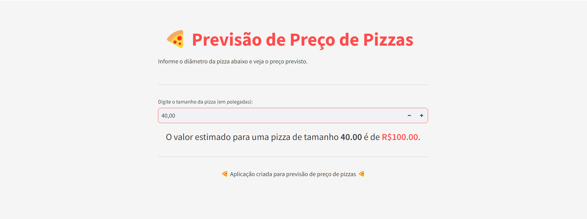

# Previsão de Preço de Pizzas 🍕

Este é um projeto de Machine Learning simples que prevê o preço de uma pizza com base no seu diâmetro, utilizando Python, Streamlit e Scikit-learn.

## Requisitos

- Python 3.x instalado
- pip para gerenciar pacotes Python

## Como rodar o projeto

Siga as etapas abaixo para rodar o projeto em sua máquina local.

### 1. Clonar o repositório

Primeiro, clone este repositório para sua máquina local:

```bash
git clone https://github.com/seu-usuario/nome-do-repositorio.git
cd nome-do-repositorio